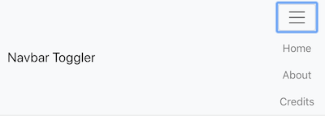

# React Navbar Toggler

A webapp example using:

- React
- React Router
- Bootstrap

with vanilla JS implementation for the Bootstrap Navbar Toggler



[Demo on Zeit](https://react-navbar-toggler.now.sh/)

# The Problem

We installed Bootstrap following the CRA [documentation](https://create-react-app.dev/docs/adding-bootstrap).

We want to use Boostrap's Navbar Toggler without having to install [React-bootstrap](https://react-bootstrap.github.io/), [Reactstrap](https://reactstrap.github.io/) or risking conflit installing JQuery in our React Webapp.

"React is unaware of changes made to the DOM outside of React. It determines updates based on its own internal representation, and if the same DOM nodes are manipulated by another library, React gets confused and has no way to recover."
[Integrating with DOM Manipulation Plugins](https://reactjs.org/docs/integrating-with-other-libraries.html)

## The Solution

We can reimplement the Navbar Toggler functionalities in our Navbar.js component


## Setup

Create a React app  
`npx create-react-app react-navbar-toggler`

Move into the project directory  
`cd react-navbar-toggler`

Install dependencies  
`yarn add node-sass bootstrap react-router-dom`

Create your project structure 

In your `Navbar.js` class component:

- Create a state in the constructor 

```jsx
    this.state = { collapsed: true };
```

- Create a function to update the state 

```jsx
    toggleNavbar = () => {
            this.setState(
                (prevState) => ({
                    collapsed: !prevState.collapsed
                })
            )
        }
```

- In the render assign the status to a variable

```jsx
const status = this.state.collapsed ? 'collapsed' : 'show';
```

- Assign the status and the function to your JSX

```jsx
<button onClick={this.toggleNavbar} className={`navbar-toggler navbar-toggler-right ${status}`} type="button" data-toggle="collapse" data-target="#navbarToggler" aria-controls="navbarToggler" aria-expanded="false" aria-label="Toggle navigation">
    <span className="navbar-toggler-icon"></span>
</button>
<div className={`collapse navbar-collapse ${status}`} id="navbarToggler">
...
</div>

```
## Reference

- https://reacttraining.com/react-router/
- https://create-react-app.dev/docs/adding-bootstrap/#using-a-custom-theme
- https://getbootstrap.com/docs/4.0/components/navbar/


Enjoy! 🥃

Berlin 19 Jan 2020
